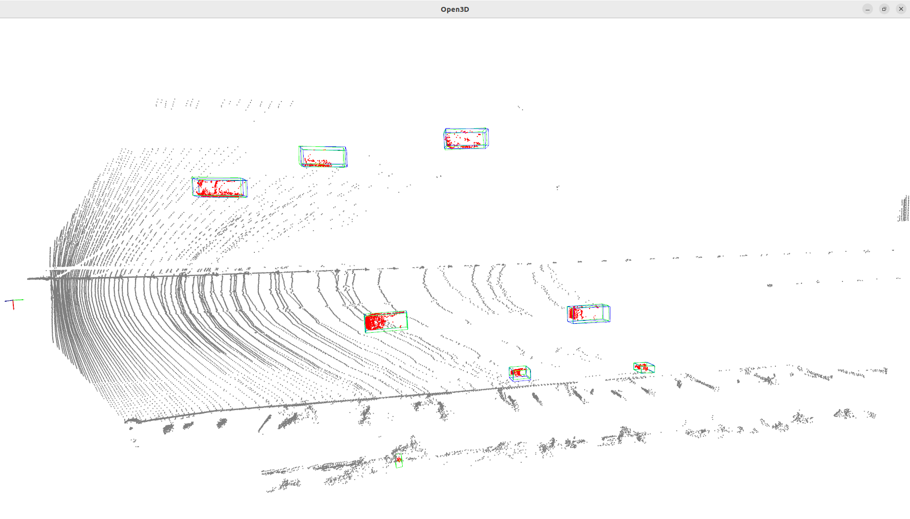
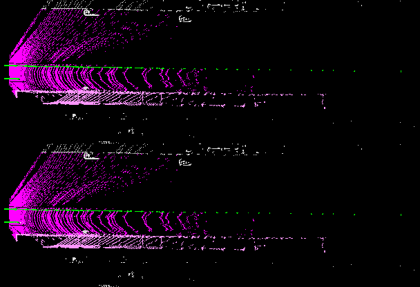

# 检测
## 数据准备
1. 将对应数据按照预先约定的形式进行放置在数据目录下（例如$data_dir），子目录结构如下：
```
├── jpg  # 图片数据
├── json # 标注数据
└── pcd  # 原始点云，pcd格式
```
2. 在工程目录下，执行如下脚本
```
cd ${WorkDir}/
python tools/create_data.py zc --root-path $data_dir --out-dir $data_dir --extra-tag json
# --root-path 指原始数据的地址
# --out-dir 输出路径地址
# --extra-tag 真值存放的相对路径
```
3. 检查成功生成后的路径
```
├── bin                      # 生成的二进制点云数据，用于训练时加速读取
├── gt_dbinfos_train.pkl     # 训练时增强用的obj样本, pkl用于训练时加速读取
├── gt_gt_database           # 训练时增强用的obj样本
├── testing_infos.pkl        # 测试集数据, pkl用于加速读取
├── training_infos.pkl       # 训练集数据, pkl用于加速读取
├── jpg
├── json
└── pcd
```
## 训练
0. 修改数据地址
```
# 修改配置中的data_root, for example: centerpoint_01voxel_second_secfpn_4x8_cyclic_20e_zc.py
data_root = $data_dir
```
1. 训练指令
```
python tools/train.py xxx_config
# for example
python tools/train.py configs/zc/centerpoint_01voxel_second_secfpn_4x8_cyclic_20e_zc.py
```
输出的log、epoch默认存储在work_dirs/xxx_config目录下，可通过传参 --work-dir $dir 修改

2. 模型配置说明
2.1 主体配置，以`centerpoint_01voxel_second_secfpn_4x8_cyclic_20e_zc.py`为例
```
# 指定继承的基础配置，同名参数会覆盖掉基础配置中同名参数内容
_base_ = [
    # 指定基础dataset 配置
    '../_base_/datasets/zc.py',
    # 指定基础model 配置
    '../_base_/models/centerpoint_01voxel_second_secfpn_zc.py',
    # 指定基础调度和runtime 配置，学习率、优化器，runner等等
    '../_base_/schedules/cyclic_20e.py', '../_base_/default_runtime.py'
]

# 指定点云范围，超出部分不管，xmin, ymin, zmin, xmax, ymax,zmax 
point_cloud_range = [0, -20, -4, 120, 20, 4]

# 指定训练类名, 需要和制作好的dataset数据对应，数量可以少于dataset中的类目数，未包含的将被忽略掉
class_names = [
    'Car', 'Pedestrian', 'Cyclist', 'Truck', 'Train'
]

# 在base 的model config基础上额外覆盖一些模型参数
model = dict(
    # 处理的点云范围
    pts_voxel_layer=dict(point_cloud_range=point_cloud_range),
    # 指定centerpoint head 的task， 如下指定了5个task, 每个task head 只负责一个类别
    pts_bbox_head=dict(
        tasks=[
            dict(num_class=1, class_names=['Car']),
            dict(num_class=1, class_names=['Pedestrian']),
            dict(num_class=1, class_names=['Cyclist']),
            dict(num_class=1, class_names=['Truck']),
            dict(num_class=1, class_names=['Train'])
        ],
        # 每个task head 对应的loss weight，weight 越大则越希望提高某个类别效果，但可能导致其他类别效果下降
        task_weight=[2.0,1.5,1.0,1.0,1.0],
        # 每个task head 对应去回归或预测哪些属性, 第一位为维度，第二位为conv 层数
        common_heads=dict(
            reg=(2, 2), height=(1, 2), dim=(3, 2), rot=(2, 2)),
        # 编码3d box 的相关参数, 
        bbox_coder=dict(pc_range=point_cloud_range[:2],
                        post_center_range=[0, -20, -4, 120, 20, 4],
                        )),
    # model training and testing settings
    # code_weights: 回归head的各个属性的权重, 顺序为reg, height, dim, rot
    train_cfg=dict(pts=dict(point_cloud_range=point_cloud_range, code_weights=[1.0, 1.0, 1.0, 1.0, 1.0, 1.0, 1.0, 1.0])),
    # post_center_limit_range: 后处理时中心的范围
    test_cfg=dict(pts=dict(pc_range=point_cloud_range[:2], post_center_limit_range=point_cloud_range)))

# 数据类型，自定义的Dataset类名
dataset_type = 'ZCDataset'
# 数据路径，按照本地电脑自行配置
data_root = '/home/jing/Data/data/20221220-det-merge/'

file_client_args = dict(backend='disk')

# 采样器配置，可以随机采样不同障碍物到当前点云中
db_sampler = dict(
    data_root=data_root,
    info_path=data_root + 'gt_dbinfos_train.pkl',
    rate=1.0,
    prepare=dict(
        filter_by_difficulty=[-1],
    # 只采样点云数大于一定值的障碍物
    filter_by_min_points=dict(Car=10, Pedestrian=10, Cyclist=10, Truck=10, Train=10)),
    classes=class_names,
    # 每个类别在采样多少个到当前帧点云中
    sample_groups=dict(Car=5, Pedestrian=5, Cyclist=5, Truck=5, Train=5),
    # 采样输入相关参数
    points_loader=dict(
        type='LoadPointsFromFile',
        coord_type='LIDAR',
        load_dim=4,
        use_dim=[0, 1, 2, 3],
        file_client_args=file_client_args))

# 训练数据预处理相关
train_pipeline = [
    # 读取数据配置
    dict(
        type='LoadPointsFromFile',
        coord_type='LIDAR',
        load_dim=4,
        use_dim=4,
        file_client_args=file_client_args),
    dict(type='LoadAnnotations3D', with_bbox_3d=True, with_label_3d=True),
    dict(type='ObjectSample', db_sampler=db_sampler),
    # 旋转和缩放数据增强, rot_range 是旋转角度范围，scale_ratio_range 是scale 的范围, translation_std 是平移的std
    dict(
        type='GlobalRotScaleTrans',
        rot_range=[-0.1, 0.1],
        scale_ratio_range=[0.95, 1.05],
        translation_std=[0, 0, 0]),
    # 随机进行点云flip, flip_ratio_bev_horizontal: 水平翻转的概率, flip_ratio_bev_vertical: 垂直翻转的概率
    dict(
        type='RandomFlip3D',
        sync_2d=False,
        flip_ratio_bev_horizontal=0.5,
        flip_ratio_bev_vertical=0.0),
    # 点云范围过滤
    dict(type='PointsRangeFilter', point_cloud_range=point_cloud_range),
    # target 障碍物范围过滤
    dict(type='ObjectRangeFilter', point_cloud_range=point_cloud_range),
    # target 类别过滤
    dict(type='ObjectNameFilter', classes=class_names),
    # 点云point顺序打乱
    dict(type='PointShuffle'),
    dict(type='DefaultFormatBundle3D', class_names=class_names),
    dict(type='Collect3D', keys=['points', 'gt_bboxes_3d', 'gt_labels_3d'])
]
test_pipeline = [
    dict(
        type='LoadPointsFromFile',
        coord_type='LIDAR',
        load_dim=4,
        use_dim=4,
        file_client_args=file_client_args),
    dict(
        type='MultiScaleFlipAug3D',
        img_scale=(1333, 800),
        # eval 时点云scale 固定, 不进行变化
        pts_scale_ratio=1,
        flip=False,
        transforms=[
            dict(
                type='GlobalRotScaleTrans',
                rot_range=[0, 0],
                scale_ratio_range=[1., 1.],
                translation_std=[0, 0, 0]),
            dict(type='RandomFlip3D'),
            dict(
                type='PointsRangeFilter', point_cloud_range=point_cloud_range),
            dict(
                type='DefaultFormatBundle3D',
                class_names=class_names,
                with_label=False),
            dict(type='Collect3D', keys=['points'])
        ])
]
eval_pipeline = [
    dict(
        type='LoadPointsFromFile',
        coord_type='LIDAR',
        load_dim=4,
        use_dim=4,
        file_client_args=file_client_args),
    dict(
    type='MultiScaleFlipAug3D',
    img_scale=(1333, 800),
    pts_scale_ratio=1,
    flip=False,
    transforms=[
        dict(
            type='PointsRangeFilter', point_cloud_range=point_cloud_range),
        dict(
            type='DefaultFormatBundle3D',
            class_names=class_names,
            with_label=False),
        dict(type='Collect3D', keys=['points'])
    ])
]

data = dict(
    samples_per_gpu=8,  # 单张 GPU 上的样本数
    workers_per_gpu=8,  # 每张 GPU 上用于读取数据的进程数
    train=dict(
        #type='CBGSDataset', # TODO add CBGS
        #dataset=dict(
        type=dataset_type,
        data_root=data_root,
        # 训练数据文件路径
        ann_file=data_root + 'training_infos.pkl',
        pipeline=train_pipeline,
        classes=class_names,
        test_mode=False,
        box_type_3d='LiDAR'),
    #),
    # val 数据文件路径
    val=dict(pipeline=test_pipeline, classes=class_names,
            ann_file=data_root + 'testing_infos.pkl',
             ),
    # test 数据文件路径
    test=dict(pipeline=test_pipeline, classes=class_names,
            ann_file=data_root + 'testing_infos.pkl',
              ))

# 每隔4个epoch eval 一次
evaluation = dict(interval=4, pipeline=eval_pipeline)

# 打印log 间隔
log_config = dict(
    interval=1)

# 训练120个epoch
runner = dict(max_epochs=120)

#lr = 1e-5
# fp16 settings
#fp16 = dict(loss_scale=64.)
```

2.2 模型结构配置，以`centerpoint_01voxel_second_secfpn_zc.py`为例
```
# voxel的尺寸（x, y, z）设置
voxel_size = [0.1, 0.1, 0.2] 
model = dict(
    type='CenterPoint',
    # max_num_points : voxel 中最多point数, voxel_size 的尺寸（x、y、z), train 和 test 最多的voxel数
    pts_voxel_layer=dict(
        max_num_points=32, voxel_size=voxel_size, max_voxels=(90000, 120000)),
    # num_features: 点的特征维度
    pts_voxel_encoder=dict(type='HardSimpleVFE', num_features=4),
    # sparse conv 编码器, sparse_shape : z y x 顺序，point_cloud_range / voxel_size 计算
    # output_channels : 输出通道数.
    # encoder_channels : 多层encoder对应的通道conv 通道数, 同时会设置stride为2，featuremap 最终变为原来 1 / 8
    # 多层encoder 对应的padding 尺寸
    pts_middle_encoder=dict(
        type='SparseEncoder',
        in_channels=4,
        sparse_shape=[41, 400, 1200],
        output_channels=128,
        order=('conv', 'norm', 'act'),
        encoder_channels=((16, 16, 32), (32, 32, 64), (64, 64, 128), (128,
                                                                      128)),
        encoder_paddings=((0, 0, 1), (0, 0, 1), (0, 0, [0, 1, 1]), (0, 0)),
        block_type='basicblock'),
    # backbone. 经过backbone 后包含两层featurempa， 尺寸分别为原始featuremap 1/8 和 1/16
    # out_channels: 输出2层，通道数分别为128，256
    # layer_nums: 输出的2层featuremap 分别使用了5层基础层
    # layer_strides: 输出的2层的conv stride
    pts_backbone=dict(
        type='SECOND',
        in_channels=256,
        out_channels=[128, 256],
        layer_nums=[5, 5],
        layer_strides=[1, 2],
        norm_cfg=dict(type='BN', eps=1e-3, momentum=0.01),
        conv_cfg=dict(type='Conv2d', bias=False)),
    # fpn neck, 经过fpn后是concat 后的 1/8 原始featuremap 大小的featuremap
    # 输入的2层feautremap 在 fpn中的输出通道数
    # upsample_strides: 2层featuremap 的上采样倍数，1表示保持原始尺寸，2 表示上采样2倍,
    pts_neck=dict(
        type='SECONDFPN',
        in_channels=[128, 256],
        out_channels=[256, 256],
        upsample_strides=[1, 2],
        norm_cfg=dict(type='BN', eps=1e-3, momentum=0.01),
        upsample_cfg=dict(type='deconv', bias=False),
        use_conv_for_no_stride=True),
    # head 参数, in_channels 对应上面的out_channels. tasks 是针对不同的任务的输出头，每个task 会输出heatmap 和 回归值, 对应是否有障碍物以及障碍物的位置、尺寸等
    pts_bbox_head=dict(
        type='CenterHead',
        in_channels=sum([256, 256]),
        tasks=[
            dict(num_class=1, class_names=['car']),
            dict(num_class=2, class_names=['truck', 'construction_vehicle']),
            dict(num_class=2, class_names=['bus', 'trailer']),
            dict(num_class=1, class_names=['barrier']),
            dict(num_class=2, class_names=['motorcycle', 'bicycle']),
            dict(num_class=2, class_names=['pedestrian', 'traffic_cone']),
        ],
        common_heads=dict(
            reg=(2, 2), height=(1, 2), dim=(3, 2), rot=(2, 2)),
        share_conv_channel=64,
        bbox_coder=dict(
            type='CenterPointBBoxCoder',
            post_center_range=[-61.2, -61.2, -10.0, 61.2, 61.2, 10.0],
            max_num=500,
            score_threshold=0.1,
            out_size_factor=8,
            voxel_size=voxel_size[:2],
            code_size=7),
        separate_head=dict(
            type='SeparateHead', init_bias=-2.19, final_kernel=3),
        loss_cls=dict(type='GaussianFocalLoss', reduction='mean'),
        loss_bbox=dict(type='L1Loss', reduction='mean', loss_weight=0.25),
        norm_bbox=True),
    # 模型训练和预测过程中的配置，若主配置有重叠，则会覆盖当前文件中的配置
    train_cfg=dict(
        pts=dict(
            grid_size=[1200, 400, 40],
            voxel_size=voxel_size,
            out_size_factor=8,
            dense_reg=1,
            gaussian_overlap=0.1,
            max_objs=500,
            min_radius=2,
            code_weights=[1.0, 1.0, 1.0, 1.0, 1.0, 1.0, 1.0, 1.0])),
    test_cfg=dict(
        pts=dict(
            post_center_limit_range=[-61.2, -61.2, -10.0, 61.2, 61.2, 10.0],
            max_per_img=500,
            max_pool_nms=False,
            min_radius=[4, 12, 10, 1, 0.85, 0.175],
            score_threshold=0.1,
            out_size_factor=8,
            voxel_size=voxel_size[:2],
            nms_type='rotate',
            pre_max_size=1000,
            post_max_size=83,
            nms_thr=0.2)))
```

## 测试
0. 修改数据地址：同训练
1. 测试指令
```
python tools/test.py xxx_config xxx_epoch.pth --eval zc
# for example
python tools/test.py configs/zc/centerpoint_01voxel_second_secfpn_4x8_cyclic_20e_zc.py work_dirs/centerpoint_01voxel_second_secfpn_4x8_cyclic_20e_zc/epoch_80.pth --eval zc
# 若需要可视化或者输出对应推理结果，加入下述参数
python tools/test.py configs/zc/centerpoint_01voxel_second_secfpn_4x8_cyclic_20e_zc.py work_dirs/centerpoint_01voxel_second_secfpn_4x8_cyclic_20e_zc/epoch_80.pth --eval zc --eval-options 'show=True' 'out_dir=./work_dirs/centerpoint_01voxel_second_secfpn_4x8_cyclic_20e_zc/eval/'
```
1.1 eval 后会在终端打印评测结果，如下：
```
Car bev_mAP40 : nan, Precision: 0.9543973941368078, Recall: 0.7855227882037533                                   │··················
Pedestrian bev_mAP40 : nan, Precision: 0.8305084745762712, Recall: 0.7903225806451613                            │··················
Cyclist bev_mAP40 : nan, Precision: 0.9153439153439153, Recall: 0.8564356435643564                               │··················
Truck bev_mAP40 : nan, Precision: 0.9411764705882353, Recall: 0.8205128205128205                                 │··················
Train bev_mAP40 : nan, Precision: 1.0, Recall: 0.9230769230769231     
```
1.2 打开show=True后，会弹出可视化窗口，如下图：
<div align="center">

</div>
其中：绿色框为prediction，蓝色框为groundtruth

鼠标左键+拖动：翻转视角
滚轮+拖动：平移
滚轮上下：缩放
下一张：q / esc

## 推理可视化(无GT)
0. 针对需要推理的pcd生成dummy pkl数据(空数据,dataset 初始化需要读取，因此填充了空的pkl data)
```
# root-path 指定存在pcd文件的目录, out-dir 指定生成的dummy pkl 路径， worker 指定生成数据调用进程数，设置成cpu核心数较好
python tools/create_data.py zc_dummy --root-path ~/Data/data/det_dummy/ --out-dir ~/Data/data/det_dummy/ --workers 16
```
1. 进行推理和可视化
```
#  configs/zc/centerpoint_01voxel_second_secfpn_4x8_cyclic_20e_zc.py : 指定训练时的config
#  work_dirs/centerpoint_01voxel_second_secfpn_4x8_cyclic_20e_zc/epoch_120.pth : 指定训练的checkpoint
#  --eval zc : 不用管
#  --eval-options  'out_dir=./work_dirs/centerpoint_01voxel_second_secfpn_4x8_cyclic_20e_zc/eval/' 'do_not_eval=True' 'show=True' : 第一个参数指定eval相关输出文件得存放位置， 第二个参数do_not_eval指定没有gt，不进行指标评估, 第三个参数show, 表示进行结果可视化
#  --cfg-options 'data_root=/home/jing/Data/data/det_dummy/' 'data.test.ann_file=/home/jing/Data/data/det_dummy/dummy_infos.pkl' : 第一个参数data_root 需要和0中一致，指定数据所在路径;第二个参数指定dummy pkl 文件的完整路径
python tools/test.py  configs/zc/centerpoint_01voxel_second_secfpn_4x8_cyclic_20e_zc.py \
    work_dirs/centerpoint_01voxel_second_secfpn_4x8_cyclic_20e_zc/epoch_120.pth \
    --eval zc   --eval-options  'out_dir=./work_dirs/centerpoint_01voxel_second_secfpn_4x8_cyclic_20e_zc/eval/' 'do_not_eval=True' 'show=True' \
    --cfg-options 'data_root=/home/jing/Data/data/det_dummy/' 'data.test.ann_file=/home/jing/Data/data/det_dummy/dummy_infos.pkl'
```

-----
# 分割
## 数据准备
1. 将对应数据按照预先约定的形式进行放置在数据目录下（例如$data_dir），子目录结构如下：
```
├── jpg  # 图片数据
├── json # 检测标注数据，非必须
└── pcd  # 原始点云+分割标注结果，pcd格式
```
2. 在工程目录下，执行如下脚本
```
cd ${WorkDir}/
python tools/create_data.py zc_semantic --root-path $data_dir --out-dir $data_dir --extra-tag json
# --root-path 指原始数据的地址
# --out-dir 输出路径地址
# --extra-tag 检测真值存放的相对路径
```
3. 检查成功生成后的路径
```
├── bin                      # 生成的二进制点云数据，用于训练时加速读取
├── gt_dbinfos_train.pkl     # detection训练时增强用的obj样本, pkl用于训练时加速读取
├── gt_gt_database           # detection训练时增强用的obj样本
├── testing_infos.pkl        # detection测试集数据, pkl用于加速读取
├── training_infos.pkl       # detection训练集数据, pkl用于加速读取
├── jpg
├── json
└── pcd
```
> ps: 考虑到后续的union，目前分割的数据处理中也包含了一部分检测的处理
## 训练
0. 修改数据地址
```
# 修改配置中的data_root, for example: centerpoint_01voxel_second_secfpn_4x8_cyclic_20e_zc_semantic.py
data_root = $data_dir
```
1. 训练指令
```
python tools/train.py xxx_config
# for example
python tools/train.py configs/zc/centerpoint_01voxel_second_secfpn_4x8_cyclic_20e_zc_semantic.py
```
输出的log、epoch默认存储在work_dirs/xxx_config目录下，可通过传参 --work-dir $dir 修改

2. 模型配置说明
2.1 主体配置，以`centerpoint_01voxel_second_secfpn_4x8_cyclic_20e_zc_semantic.py`为例
```
# 指定继承的基础配置，同名参数会覆盖掉基础配置中同名参数内容
_base_ = [
    # 指定基础dataset 配置
    '../_base_/datasets/zc_semantic.py',
    # 指定基础model 配置
    '../_base_/models/centerpoint_01voxel_second_secfpn_zc_semantic.py',
    # 指定基础调度和runtime 配置，学习率、优化器，runner等等
    '../_base_/schedules/cyclic_20e.py', '../_base_/default_runtime.py'
]

# 指定点云范围，超出部分不管，xmin, ymin, zmin, xmax, ymax,zmax 
point_cloud_range = [0, -20.8, -4, 121.6, 20.8, 4]

# 指定训练类名, 需要和制作好的dataset数据对应，数量可以少于dataset中的类目数，未包含的将被忽略掉
class_names = [
    'Car', 'Pedestrian', 'Cyclist', 'Truck', 'Train'
]
seg_class_names = [
    'Kong', 'Unlabel', 'Road', 'Station', 'Fence']
#    none,      0,        1,      2,         3

# 在base 的model config基础上额外覆盖一些模型参数
model = dict(
    # 处理的点云范围
    pts_voxel_layer=dict(point_cloud_range=point_cloud_range),
    # model training and testing settings
    # code_weights: 回归各个属性的权重
    train_cfg=dict(pts=dict(point_cloud_range=point_cloud_range, code_weights=[0, 1, 1, 10.0, 10.0])),
    test_cfg=dict(pts=dict(pc_range=point_cloud_range[:2], 
                  point_cloud_range=point_cloud_range,
                  code_weights=[0, 1,  1, 1.0, 1.0])))

dataset_type = 'ZCSemanticDataset'
data_root = '/home/jing/Data/data/seg/test/'

file_client_args = dict(backend='disk')

#TODO with this
db_sampler = dict(
    data_root=data_root,
    info_path=data_root + 'gt_dbinfos_train.pkl',
    rate=1.0,
    prepare=dict(
        filter_by_difficulty=[-1],
    filter_by_min_points=dict(Car=10, Pedestrian=10, Cyclist=10, Truck=10, Train=10)),
    classes=class_names,
    sample_groups=dict(Car=5, Pedestrian=5, Cyclist=5, Truck=5, Train=5),
    points_loader=dict(
        type='LoadPointsFromFile',
        coord_type='LIDAR',
        load_dim=4,
        use_dim=[0, 1, 2, 3],
        file_client_args=file_client_args))

# 训练数据预处理相关
train_pipeline = [
    # 读取数据配置
    dict(
        type='LoadPointsFromFile',
        coord_type='LIDAR',
        load_dim=5,
        use_dim=5,
        file_client_args=file_client_args),
    dict(type='LoadAnnotations3D', with_bbox_3d=True, with_label_3d=True),
    # dict(type='ObjectSample', db_sampler=db_sampler),
    # 旋转和缩放数据增强, rot_range 是旋转角度范围，scale_ratio_range 是scale 的范围, translation_std 是平移的std
    dict(
        type='GlobalRotScaleTrans',
        rot_range=[-0.1, 0.1],
        scale_ratio_range=[0.95, 1.05],
        translation_std=[0, 0, 0]),
    # 随机进行点云flip, flip_ratio_bev_horizontal: 水平翻转的概率, flip_ratio_bev_vertical: 垂直翻转的概率
    dict(
        type='RandomFlip3D',
        sync_2d=False,
        flip_ratio_bev_horizontal=0.5,
        flip_ratio_bev_vertical=0.0),
    # 点云范围过滤
    dict(type='PointsRangeFilter', point_cloud_range=point_cloud_range),
    # 点云point顺序打乱
    dict(type='PointShuffle'),
    dict(type='DefaultFormatBundle3D', class_names=class_names),
    dict(type='Collect3D', keys=['points', 'gt_bboxes_3d', 'gt_labels_3d'])
]
test_pipeline = [
    dict(
        type='LoadPointsFromFile',
        coord_type='LIDAR',
        load_dim=5,
        use_dim=5,
        file_client_args=file_client_args),
    dict(
        type='MultiScaleFlipAug3D',
        img_scale=(1333, 800),
        # eval 时点云scale 固定, 不进行变化
        pts_scale_ratio=1,
        flip=False,
        transforms=[
            dict(
                type='GlobalRotScaleTrans',
                rot_range=[0, 0],
                scale_ratio_range=[1., 1.],
                translation_std=[0, 0, 0]),
            dict(type='RandomFlip3D'),
            dict(
                type='PointsRangeFilter', point_cloud_range=point_cloud_range),
            dict(
                type='DefaultFormatBundle3D',
                class_names=class_names,
                with_label=False),
            dict(type='Collect3D', keys=['points'])
        ]),
]

eval_pipeline = [
    dict(
        type='LoadPointsFromFile',
        coord_type='LIDAR',
        load_dim=5,
        use_dim=5,
        file_client_args=file_client_args),
    dict(type='MultiScaleFlipAug3D',
    img_scale=(1333, 800),
    pts_scale_ratio=1,
    flip=False,
    transforms=[
        dict(type='PointsRangeFilter', point_cloud_range=point_cloud_range),
        dict(type='DefaultFormatBundle3D',
             class_names=class_names,
             with_label=False),
        dict(type='Collect3D', keys=['points'])
    ])
]

data = dict(
    samples_per_gpu=4,  # 单张 GPU 上的样本数
    workers_per_gpu=4,  # 每张 GPU 上用于读取数据的进程数
    train=dict(
        #type='CBGSDataset', # TODO add CBGS
        #dataset=dict(
        type=dataset_type,
        data_root=data_root,
        # 训练数据文件路径
        ann_file=data_root + 'training_infos.pkl',
        pipeline=train_pipeline,
        classes=class_names,
        test_mode=False,
        #use_valid_flag=True,
        # we use box_type_3d='LiDAR' in kitti and nuscenes dataset
        # and box_type_3d='Depth' in sunrgbd and scannet dataset.
        box_type_3d='LiDAR'),
    #),
    # val 数据文件路径
    val=dict(pipeline=test_pipeline, classes=class_names,
            ann_file=data_root + 'testing_infos.pkl',
             ),
    # test 数据文件路径
    test=dict(pipeline=test_pipeline, classes=class_names,
            ann_file=data_root + 'testing_infos.pkl',
             # do_not_eval=True, #打开则不进行eval，可对原始数据进行推理
            )

evaluation = dict(interval=10, pipeline=eval_pipeline)

log_config = dict(
    interval=1)

runner = dict(max_epochs=80)

```

2.2 模型结构配置，以`centerpoint_01voxel_second_secfpn_zc_semantic.py`为例
```
voxel_size = [0.2, 0.2, 0.2]
model = dict(
    type='CenterPointSemantic',
    # max_num_points : voxel 中最多point数, voxel_size 的尺寸（x、y、z), train 和 test 最多的voxel数
    pts_voxel_layer=dict(
        max_num_points=32, voxel_size=voxel_size, max_voxels=(90000, 120000)),
    # num_features: 点的特征维度
    pts_voxel_encoder=dict(type='HardSimpleVFE', num_features=4),
    # sparse conv 编码器, sparse_shape : z y x 顺序，point_cloud_range / voxel_size 计算
    # output_channels : 输出通道数.
    # encoder_channels : 多层encoder对应的通道conv 通道数, 同时会设置stride为2，featuremap 最终变为原来 1 / 8
    # 多层encoder 对应的padding 尺寸
    pts_middle_encoder=dict(
        type='SparseEncoder',
        in_channels=4,
        sparse_shape=[41, 208, 608],
        output_channels=128,
        order=('conv', 'norm', 'act'),
        encoder_channels=((16, 16, 32), (32, 32, 64), (64, 64, 128), (128,
                                                                      128)),
        encoder_paddings=((0, 0, 1), (0, 0, 1), (0, 0, [0, 1, 1]), (0, 0)),
        block_type='basicblock'),
    # backbone. 经过backbone 后包含两层featurempa， 尺寸分别为原始featuremap 1/8 和 1/16
    # out_channels: 输出2层，通道数分别为128，256
    # layer_nums: 输出的2层featuremap 分别使用了5层基础层
    # layer_strides: 输出的2层的conv stride
    pts_backbone=dict(
        type='SECOND',
        in_channels=256,
        out_channels=[128, 256],
        layer_nums=[5, 5],
        layer_strides=[1, 2],
        norm_cfg=dict(type='BN', eps=1e-3, momentum=0.01),
        conv_cfg=dict(type='Conv2d', bias=False)),
    # fpn neck, 经过fpn后是concat 后的 1/8 原始featuremap 大小的featuremap
    # 输入的2层feautremap 在 fpn中的输出通道数
    # upsample_strides: 2层featuremap 的上采样倍数，1表示保持原始尺寸，2 表示上采样2倍,
    pts_neck=dict(
        type='SECONDFPN',
        in_channels=[128, 256],
        out_channels=[256, 256],
        upsample_strides=[1, 2],
        norm_cfg=dict(type='BN', eps=1e-3, momentum=0.01),
        upsample_cfg=dict(type='deconv', bias=False),
        use_conv_for_no_stride=True),
    # head 参数, in_channels 对应上面的out_channels. tasks 是针对不同的任务的输出头，每个task 会输出heatmap 和 回归值, 对应是否有seg cls
    pts_bbox_head=dict(
        type='SemanticHead',
        in_channels=sum([256, 256]),
        out_channels=[256, 256],
        num_classes=5,
        seg_score_thr=0.3,
        loss_seg=dict(type='FocalLoss', loss_weight=1)
        ),
    # model training and testing settings
    train_cfg=dict(
        pts=dict(
            grid_size=[608, 208, 40],
            voxel_size=voxel_size,
            out_size_factor=8,
            dense_reg=1,
            gaussian_overlap=0.1,
            max_objs=500,
            min_radius=2,
            code_weights=[1.0, 1.0, 1.0, 1.0, 1.0, 1.0, 1.0, 1.0])),
    test_cfg=dict(
        pts=dict(
            post_center_limit_range=[-61.2, -61.2, -10.0, 61.2, 61.2, 10.0],
            max_per_img=500,
            max_pool_nms=False,
            min_radius=[4, 12, 10, 1, 0.85, 0.175],
            score_threshold=0.1,
            out_size_factor=8,
            voxel_size=voxel_size[:2],
            nms_type='rotate',
            pre_max_size=1000,
            post_max_size=83,
            nms_thr=0.2))
    )
```

## 测试
0. 修改数据地址：同训练
1. 测试指令
```
python tools/test.py xxx_config xxx_epoch.pth --eval zc_semantic
# for example
python tools/test.py configs/zc/centerpoint_01voxel_second_secfpn_4x8_cyclic_20e_zc_semantic.py work_dirs/centerpoint_01voxel_second_secfpn_4x8_cyclic_20e_zc_semantic/epoch_80.pth --eval zc_semantic
# 若需要可视化或者输出对应推理结果，加入下述参数，
python tools/test.py configs/zc/centerpoint_01voxel_second_secfpn_4x8_cyclic_20e_zc_semantic.py work_dirs/centerpoint_01voxel_second_secfpn_4x8_cyclic_20e_zc_semantic/epoch_80.pth --eval zc_semantic--eval-options 'out_dir=./work_dirs/centerpoint_01voxel_second_secfpn_4x8_cyclic_20e_zc_semantic/eval/'
# 最终的可视化结果以图片形式存储在centerpoint_01voxel_second_secfpn_4x8_cyclic_20e_zc_semantic/eval/predict目录

```
> 若需要对无真值的数据做推理，则在主配置中讲`do_not_eval=True`取消注释；

分割效果如图所示，其中上图为预测结果，下图为真值。

<div align="center">

</div>
其中深红色为路面，浅红色为站台，绿色为栅栏

## 推理可视化(无GT)
0. 针对需要推理的pcd生成dummy pkl数据(空数据,dataset 初始化需要读取，因此填充了空的pkl data)
```
# root-path 指定存在pcd文件的目录, out-dir 指定生成的dummy pkl 路径， worker 指定生成数据调用进程数，设置成cpu核心数较好
python tools/create_data.py zc_dummy --root-path ~/Data/data/det_dummy/ --out-dir ~/Data/data/det_dummy/ --workers 16
```
1. 修改训练config中的do_not_eval flag, 例如`configs/zc/centerpoint_01voxel_second_secfpn_4x8_cyclic_20e_zc_semantic.py`

2. 进行推理
> 同测试指令